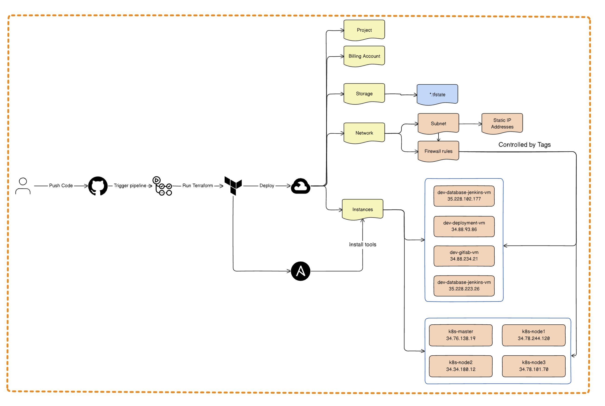

# GCP Infrastructure Automation with Terraform and GitHub Actions

## Project Overview

This repository contains Terraform configuration files and GitHub Actions workflows that automate the process of deploying and managing Google Cloud infrastructure. The pipeline runs automatically when changes are pushed to the main branch, deploying the resources defined in the Terraform configuration.

## Architecture

Below is the architecture diagram of the infrastructure deployment:



## Prerequisites

Ensure that you configure the `terraform.tfvars` file with the following parameters before running the deployment pipeline:

```hcl
project             = "xenon-pager-436506-m9"
region              = "europe-north1"
zone                = "europe-north1-a"
machine_type_small  = "e2-small"
machine_type_medium = "e2-medium"
ssh_user            = "gcp_htrung"
```

### On locals
1. Clone project
```
git clone https://github.com/htrungngx/terraform-infra.git
```
2. Move to project folder
```
cd terraform-infra
```
3. Initialize Terraform
Initialize your Terraform configuration:
```
terraform init
```
4. Plan Terraform Configuration
Review an execution plan
```
terraform plan
```
5. Apply Terraform Configuration
Apply the configuration to create the resources:
```
terraform apply
```
6. Destroy Terraform-managed Infrastructure
```
terraform destroy
```

### Github actions
#### Setting up GitHub Secrets for GCP
- GCP Project ID

1. Navigate to your GCP dashboard and note down your project ID (e.g., `xenon-pager-436506-m9`).
2. Go to your GitHub repository settings: `Settings > Secrets and variables > Actions > New repository secret`.
3. Add a new secret with the name `GCP_PROJECT` and the value as your GCP project ID.

- GCP Credentials (Service Account Key)

1. In GCP, create a Service Account with the necessary permissions (e.g., roles for Compute Engine, Storage, and Networking). You can create a service account from the IAM & Admin section of your GCP Console.
2. Download the JSON key for the service account.
3. In your GitHub repository, add a new secret for this service account key:
   - **Name**: `GCP_CREDENTIALS`
   - **Value**: Paste the content of the JSON key you downloaded.

The GitHub Actions workflow will use this secret to authenticate to Google Cloud and execute the Terraform commands.

- Triggering the Pipeline

You can trigger the CI/CD pipeline using specific commit messages when pushing changes to the main branch:

To apply changes or commit your code with the following message format:

```bash
git commit -m "[implement] - Description of your changes"
git push origin main
```

To destroy the infrastructure, use the following commit message format:
```bash
git commit -m "[destroy] - Description of the destruction"
git push origin main
```